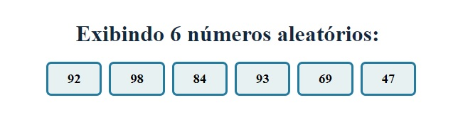

*Primeira aplicação em Spring MVC usando Thymeleaf

**Projeto Sistema Web MVC e SQL

- Construir uma aplicação Spring que exiba 6 números aleatórios usando Thymeleaf.
- Entregar informando o link do repositório GitHub com o projeto desenvolvido.

## A Aplicação será visualizada no navegador da segunte maneira

